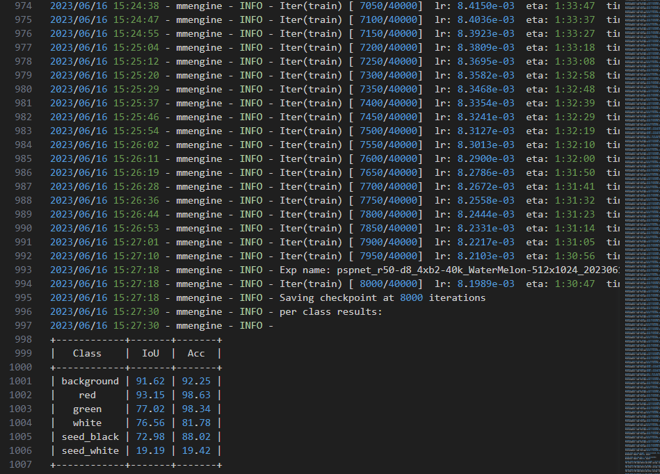
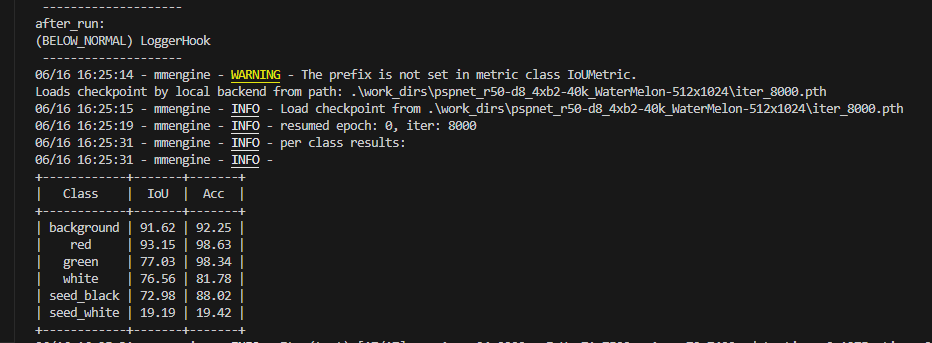

# 1. 配置文件
路径: ./myconfigs/pspnet_r50-d8_4xb2-40k_WaterMelon-512x1024.py

这里只展示数据集部分
```python
train_dataloader = dict(
    batch_size=2,
    num_workers=2,
    persistent_workers=True,
    sampler=dict(type='InfiniteSampler', shuffle=True),
    dataset=dict(
        type='WaterMelonDataset',
        data_root='data/Watermelon87_Semantic_Seg_Mask/',
        data_prefix=dict(
            img_path='img_dir/train', seg_map_path='ann_dir/train'),
        pipeline=[
            dict(type='LoadImageFromFile'),
            dict(type='LoadAnnotations'),
            dict(
                type='RandomResize',
                scale=(2048, 1024),
                ratio_range=(0.5, 2.0),
                keep_ratio=True),
            dict(type='RandomCrop', crop_size=(512, 1024), cat_max_ratio=0.75),
            dict(type='RandomFlip', prob=0.5),
            dict(type='PhotoMetricDistortion'),
            dict(type='PackSegInputs')
        ]))
val_dataloader = dict(
    batch_size=1,
    num_workers=4,
    persistent_workers=True,
    sampler=dict(type='DefaultSampler', shuffle=False),
    dataset=dict(
        type='WaterMelonDataset',
        data_root='data/Watermelon87_Semantic_Seg_Mask/',
        data_prefix=dict(
            img_path='img_dir/val', seg_map_path='ann_dir/val'),
        pipeline=[
            dict(type='LoadImageFromFile'),
            dict(type='Resize', scale=(2048, 1024), keep_ratio=True),
            dict(type='LoadAnnotations'),
            dict(type='PackSegInputs')
        ]))
test_dataloader = val_dataloader
```

# 2. 自定义数据集
路径: ./mmseg/datasets/watermelon.py 定义了自定义数据集
```python
# Copyright (c) OpenMMLab. All rights reserved.

from mmseg.registry import DATASETS
from .basesegdataset import BaseSegDataset


@DATASETS.register_module()
class WaterMelonDataset(BaseSegDataset):
    """DRIVE dataset.

    In segmentation map annotation for DRIVE, 0 stands for background, which is
    included in 2 categories. ``reduce_zero_label`` is fixed to False. The
    ``img_suffix`` is fixed to '.png' and ``seg_map_suffix`` is fixed to
    '_manual1.png'.
    """
    METAINFO = dict(
        classes=('background', 'red', 'green', 'white', 'seed_black', 'seed_white'),
        palette=[[255, 255, 255], [255, 0, 0], [255, 255, 0], [0, 0, 255],
                 [159, 129, 183], [0, 255, 0]])

    def __init__(self,
                 img_suffix='.jpg',
                 seg_map_suffix='.png',
                 reduce_zero_label=False,
                 **kwargs) -> None:
        super().__init__(
            img_suffix=img_suffix,
            seg_map_suffix=seg_map_suffix,
            reduce_zero_label=reduce_zero_label,
            **kwargs)
        # assert self.file_client.exists(self.data_prefix['img_path'])
```

# 3. 训练

这里指标达到要求后就停止训练了,在后续测试使用了第8000次迭代的checkpoint.

# 4. 测试

不知道为什么 --show 或者--show-dir 都不起作用, 不显示推理的结果图像
测试日志在: ./work_dirs/20230616_162510/    路径下
